# FREE OPENSOURCE M3U/XTREME IPTV PLAYER

This IPTV player, built with Python and PyQt5, supports Xtream Codes accounts, including credential extraction from Xtream M3U Plus `get.php` URLs. Generic M3U playlist files and URLs are not supported.

[**View all releases**](https://github.com/Youri666/Xtream-m3u_plus-IPTV-Player/releases)

# Features

- **Windows, MacOS, and Linux support**
- **Xtream account support:** Sign in manually or extract credentials from an Xtream M3U Plus `get.php` URL. Generic M3U playlists are not supported.
- **Multi-account profiles:** Keep favorites, category choices, EPG offsets, tab order, default tab, and cached catalogs separate for each account.
- **Live TV, Movies, and Series:** Browse categorized catalogs with search, remembered sorting, item counts, favorites, and detailed information panels.
- **EPG:** View program schedules and descriptions with an account-specific time offset.
- **History and playback resume:** Return to recently played content and resume partially watched media.
- **Internal VLC player:** Use playlist navigation, configurable seeking and buffering, subtitles, audio tracks, fullscreen, and optional automatic advancement to the next item.
- **External players:** Open content in applications such as VLC or SMPlayer.
- **Movie and Series metadata:** View provider information and optionally fill missing details, posters, and trailers with a personal TMDB API Read Access Token.
- **Link and M3U export:** Copy direct URLs, save readable text files, or create M3U playlists for Live channels, Movies, Series, individual items, multiple selections, or complete categories.
- **Personalized interface:** Reorder tabs, choose the startup tab, resize columns, and use Light, Dark, or System themes.
- **Update notifications:** Check manually or automatically for stable releases; beta builds can also follow newer beta versions.
- **Cross-platform build scripts:** Create Windows, MacOS, and Linux packages from isolated local Python environments.

### Recommended media players

For the best experience, install [VLC media player](https://www.videolan.org/vlc/). VLC is required for the **Internal Player** and is the highly recommended option.

For external playback, the following players are supported:

- [VLC media player](https://www.videolan.org/vlc/) — recommended
- [SMPlayer](https://www.smplayer.info/)

# Future plans

- **M3U file support:** Select a local M3U file or a URL to an M3U file and load its data.


# User Guide

## Main interface

The main interface is organized into six tabs: **Live**, **Movies**, **Series**, **History**, **Info**, and **Settings**.

Tabs can be reordered by dragging them. Their order is saved independently for each IPTV account. The tab shown at startup can be selected with **Default tab** under **Settings → Content and appearance**, including an option to restore the last selected tab.

The **Live**, **Movies**, and **Series** tabs all use the same three-column layout:
- **Left column:** categories
- **Middle column:** items available in the selected category
- **Right column:** information about the currently selected item

You can navigate through the first two columns with the **Up/Down arrow keys** and use **Enter** to open or select an item.

Use **Ctrl** or **Shift** to select multiple categories or items. Right-click a selection to copy its direct URLs, save a readable text file, or create an M3U playlist that can be opened in a compatible media player. Selecting **All** takes priority over any other selected category. Complete `All` exports are disabled by default, and complete-Series exports are limited to 10 series because every series requires a separate provider request. Both safeguards can be adjusted under **Settings → Advanced settings → M3U export**.

Both the category and content lists include a **search bar**, a **clear search** button, and a **filter** button.  
The first column also includes a **Categories** button that lets you choose which categories are visible.

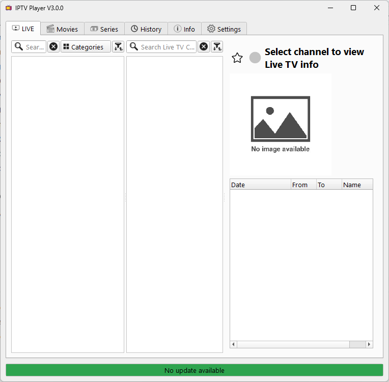

## History tab

The **History** tab keeps track of recently viewed content and separates it into **Live**, **Movies**, and **Series**.

Each section shows the **last viewed date/time** and the corresponding **title**, making it easy to find content that was previously opened.

The maximum number of history entries is configurable in **Advanced Settings**. The default value is **50 items per content type**.

History is stored independently for each IPTV account. Activating an entry opens its original tab and category, then selects the corresponding channel, movie, or episode so it can be found quickly. The Internal Player can resume partially watched content from its saved position. If an item is no longer present in the provider catalog, its obsolete entry is automatically removed from History.

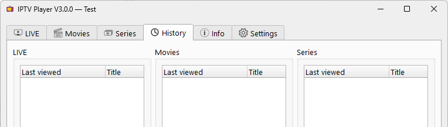

## Info tab

The **Info** tab displays information about the currently selected IPTV account.

Its content is refreshed automatically when the tab is opened. A manual refresh can also be triggered with the **Refresh** button.

The refresh interval can be configured in **Advanced Settings**. To avoid unnecessary requests, the information is only refreshed while the **Info** tab is actually being viewed.

The selector above the tabs shows the active IPTV account and allows it to be changed quickly.

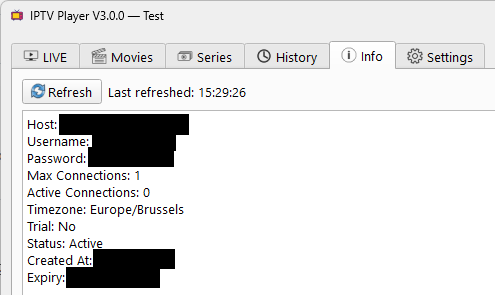

## Settings

The **Settings** tab groups the main application preferences, including IPTV accounts, visible content, appearance, sorting, media player selection, advanced options, and update settings.

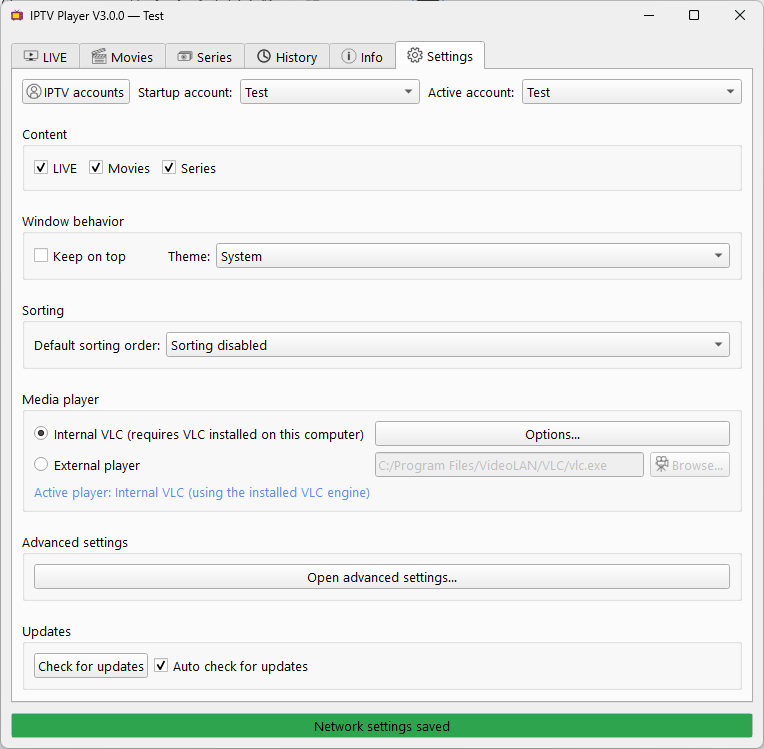

### IPTV accounts

The **IPTV accounts** button opens the account manager, where accounts can be added, edited, or removed.

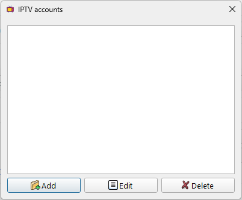

Two account input methods are available:

- **Manual/Xtream entry:** enter the server URL, username, password, and stream URL formats manually.
- **Xtream M3U Plus URL:** paste an Xtream `get.php` URL and let the application extract the required credentials. Generic M3U playlist files and URLs are not supported.

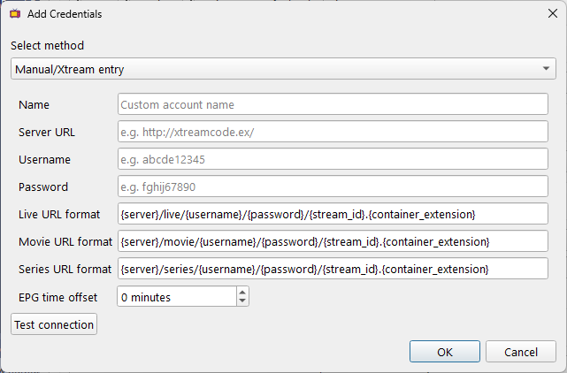

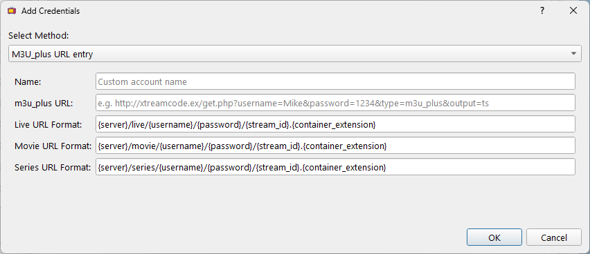

Stream URL formats are fully editable because IPTV providers do not always use the same URL structure. If Live TV does not work with the default format, hover over **Live URL format** to display a tooltip with common alternative formats.

Each account can use its own **EPG time offset** to correct schedule times by up to 12 hours in either direction. Use **Test connection** to validate the credentials and account status before saving, without downloading the full provider catalog.

The **Startup account** selects which account should be loaded when the application starts. The **Active account** can be used to switch immediately between configured IPTV accounts.

**My Live TV doesn't work, but Movies and Series do. How can I fix this?**

Some IPTV providers require a different URL format for LIVE streams.
Edit the affected account and try replacing the **Live URL format** with one of the following:

```text
{server}/{username}/{password}/{stream_id}
{server}/{username}/{password}/{stream_id}.ts
{server}/{username}/{password}/{stream_id}.m3u8
{server}/{username}/{password}/live/{stream_id}
{server}/{username}/{password}/live/{stream_id}.ts
{server}/{username}/{password}/live/{stream_id}.m3u8
{server}/live/{username}/{password}/{stream_id}
{server}/live/{username}/{password}/{stream_id}.ts
{server}/live/{username}/{password}/{stream_id}.m3u8
```

If none of these formats work, please open an issue on the V3 repository: [Issues](https://github.com/Youri666/Xtream-m3u_plus-IPTV-Player/issues)

### Content and appearance

The **LIVE**, **Movies**, and **Series** options control which content sections are displayed. Disabled content types are also hidden from related parts of the application, such as History.

The **Default tab** setting selects the tab opened for each IPTV account. Choose **Last selected tab** to restore the most recently used tab for that account.

**Keep on top** keeps the main window above other windows.

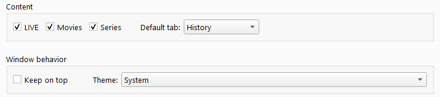

The theme can be set to:

- **System** — follows the operating system appearance
- **Light**
- **Dark**

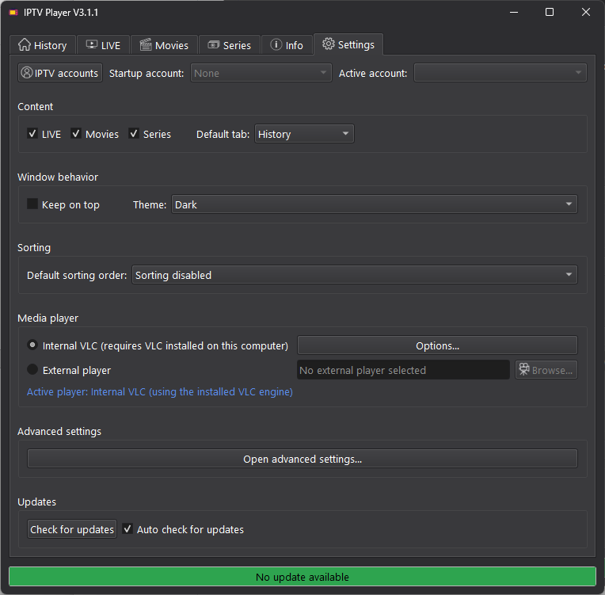

### Sorting

The default sorting mode can be configured globally.

Available modes include:
- **Default order** — keep the order provided by the IPTV provider; in Favorites, items can be dragged into a custom order saved separately for each account
- **A → Z**
- **Z → A**
- **Remember per list** — each list/category can use its own sorting mode, selected with the sorting button and remembered for future use

The per-list sorting preferences are stored so they persist between sessions.

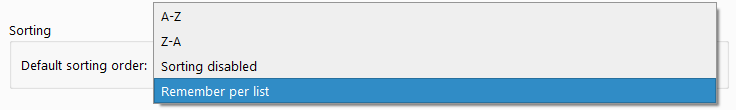


### Media player

The recommended option is the built-in **Internal VLC** player, which uses the VLC engine installed on the computer.

An external media player can also be selected.

The internal player has its own configurable options:

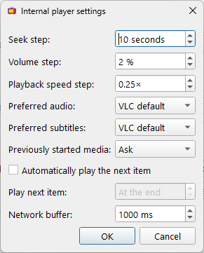

These settings control seek, volume, and playback-speed steps, preferred audio and subtitle languages, and what should happen when opening media that was previously started. They also include:

- **Automatically play the next item** — continue through the current playlist without manual input.
- **Play next item** — start the next item at the end or up to 300 seconds before the current item finishes, allowing final credits to be skipped.
- **Network buffer** — adjust VLC network caching for streamed media.

When **Previously started media** is set to **Ask**, the player can offer to **Resume**, **Restart**, or **Cancel** playback.

### Advanced settings

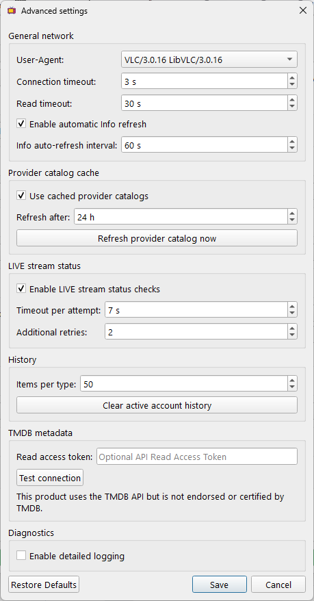

Advanced settings provide additional control over:
- network timeouts and User-Agent
- automatic Info-tab refresh
- provider catalog caching and refresh interval
- LIVE stream availability checks
- M3U export safeguards for complete catalogs and multi-Series requests
- detailed diagnostic logging
- History size and cleanup
- optional TMDB metadata enrichment with a connection test

When **LIVE stream status checks** are enabled, the Live TV information panel displays a small status indicator for the selected stream: **green** when the stream is available and **red** when it is unavailable. This check can be disabled from Advanced Settings.

Provider catalog caching can significantly reduce loading time by reusing locally stored catalog data instead of downloading it again when it is still valid.

To complete missing movie and series information, enter a personal [**TMDB API Read Access Token**](https://developer.themoviedb.org/docs/authentication-application) in Advanced Settings and use **Test connection** before saving. TMDB enrichment is only attempted when the IPTV provider supplies a valid TMDB identifier. Existing provider metadata remains unchanged; TMDB fills missing fields only.

This product uses the TMDB API but is not endorsed or certified by TMDB.

### Updates

The application can check for new releases manually with **Check for updates**, or automatically when **Auto check for updates** is enabled.

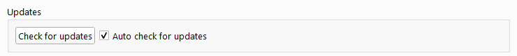


## Internal player

The built-in **Internal Player** provides direct playback using the installed VLC engine.

The button in the upper-left corner shows or hides the playlist panel. Its content follows where playback was started: for example, launching an episode from a Series season makes the other episodes from that season available for quick navigation. The panel also includes a filter field.

Playback controls provide previous/next navigation, play/pause, seeking, playback speed, volume, audio track selection, subtitles when available, and fullscreen mode.

- Drag the progress bar with the left mouse button to move backward or forward.
- Use the mouse wheel over the progress bar to seek in configurable steps. Multiple wheel movements are briefly accumulated to allow precise seeking.
- Use the mouse wheel over the video or playback controls to seek; use it over the volume control to adjust the volume.
- During Live TV playback, **LIVE** is displayed instead of a playback position.
- Minimizing the player automatically pauses playback; restoring the window resumes it.

### Keyboard shortcuts

- **Page Up / Page Down** — previous / next item
- **Left / Right Arrow** — seek backward / forward
- **Space** — play / pause
- **+ / -** — increase / decrease playback speed
- **Mouse wheel over the video or playback controls** — seek backward / forward
- **Mouse wheel over the volume control** — increase / decrease volume
- **M** — mute / unmute
- **A** — cycle through available audio tracks
- **S** — cycle through available subtitles
- **F** — toggle fullscreen

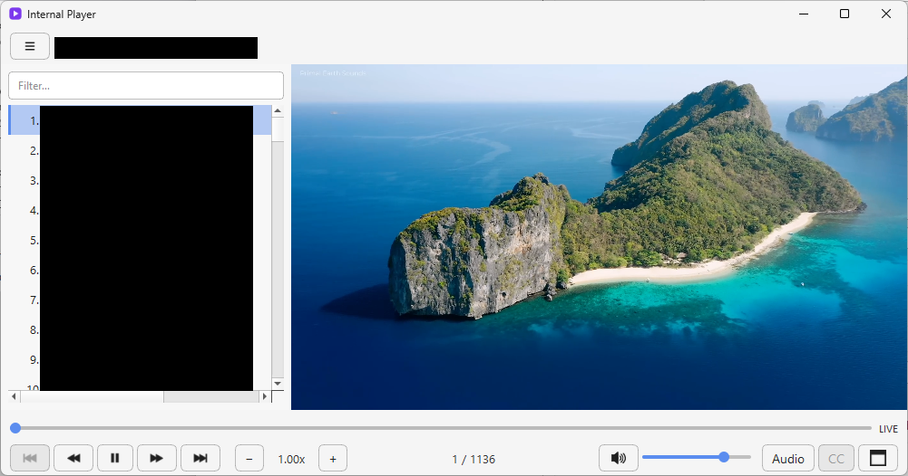


# What's new in V3

Version 3 reorganizes the application into clearer, reusable components and adds automated regression tests, safer configuration migrations, and more consistent behavior across Windows, MacOS, and Linux. The V3.1 releases extend that foundation with more account personalization, playback controls, metadata, and export options.

| | |
|---|---|
| **Refactored and tested codebase** | The interface, provider access, configuration, storage, caching, themes, playback, and startup logic now use dedicated components. Automated tests cover the main workflows and bug fixes. |
| **Safer configuration and diagnostics** | Settings are written atomically and upgraded through configuration migrations. Network options, privacy-conscious logging, and isolated build environments make the application easier to maintain and troubleshoot. |
| **Better multi-account support** | Accounts use stable identifiers and keep their catalogs, favorites, category preferences, EPG offsets, tab order, default tab, and last selected tab independently. The account selector provides quick switching without losing the current functional tab. |
| **Improved catalogs and navigation** | Shared Live, Movies, and Series components provide consistent searching, sorting, category counts, favorite handling, and stale-selection cleanup. Provider caching can reduce startup and account-switching time. |
| **Richer information panels** | Movie and Series descriptions use the available space more effectively, Live EPG descriptions are easier to read, and optional TMDB enrichment can fill metadata, posters, and trailers missing from the provider. |
| **VOD link export** | Context menus can copy direct Movie or Episode URLs, or save structured link files for Movies, Episodes, Seasons, and complete Series. Sensitive URLs and credentials are excluded from diagnostic logs. |
| **Internal Player improvements** | Playback can pause when minimized, resume previously started media, advance automatically to the next item, skip final credits, use configurable network buffering, and seek by dragging or using the mouse wheel. |
| **Interface and update improvements** | Themes follow Windows, MacOS, and Linux more reliably, dialogs and information panels have been polished, and beta builds can detect newer beta releases as well as the corresponding stable release. |


# How to compile the source code

All build scripts create a local `.venv`, install PyInstaller and the application
dependencies from `requirements-build.txt`, and use that isolated environment.
An Internet connection is required the first time. Delete `.venv` to recreate it
after changing the installed Python version. No Python packages need to be
installed globally.

<details>
<summary><h3>Windows</h3></summary>

#### 1. Install Python 3

Install the latest Python 3 from [python.org](https://www.python.org/downloads/).

During installation:
- Use administrator privileges when appropriate.
- Add `python.exe` to the system `PATH`.

VLC must also be installed if you want to use the Internal Player.

#### 2. Build

Run:

```text
build_IPTV_Player_Win.bat
```

The generated files are written to the `dist` directory.

</details>

<details>
<summary><h3>MacOS</h3></summary>

#### 1. Install the required applications

- Install the latest Python 3 from [python.org](https://www.python.org/downloads/macos/).
- Install the latest VLC from [videolan.org](https://www.videolan.org/vlc/) in `/Applications`.

#### 2. Build the application

Make the MacOS build script executable:

```bash
chmod +x build_IPTV_Player_macOS.sh
```

Run:

```bash
./build_IPTV_Player_macOS.sh
```

The build creates:

```text
dist/IPTV Player.app
dist/IPTV Player Vx.x.x.dmg
```

The `.app` bundle can be used for local testing. The versioned `.dmg` package is intended for distribution.

#### 3. Install the application

Open the generated `.dmg` file and drag `IPTV Player.app` onto the `Applications` shortcut.

The build script removes PyInstaller's duplicate executable folder after the `.app` bundle has been created.

Because the application is not currently code-signed, MacOS may require you to Control-click the application and choose **Open** on first launch.

</details>

<details>
<summary><h3>Linux</h3></summary>

#### 1. Install the required development packages

Install Python 3, its development files, and pip using `dnf`.

For example:

```bash
sudo dnf install python3 python3-devel python3-pip
```

If you build Python yourself, configure it with shared-library support:

```bash
./configure --enable-shared
```

Install VLC/libVLC separately if you want to use the Internal Player.

#### 2. Build

```bash
chmod +x build_IPTV_Player_Linux.sh
./build_IPTV_Player_Linux.sh
```

The generated files are written to the `dist` directory.

</details>

# Configuration migrations

`userdata.ini` records the version of its persisted-data schema:

```ini
[Application]
config_schema_version = 1
```

`config_schema_version` identifies the structure and meaning of the persisted data.

When a major or minor update changes that structure, the application can compare this number with `CURRENT_CONFIG_SCHEMA_VERSION` and apply every missing migration in order.

For example, schema 1 converts the former combined `VOD` option into independent LIVE, Movies, and Series options while preserving the user's previous choice.

This value is deliberately separate from `CURRENT_VERSION`. The application version is already compiled into the executable and is used by the GitHub update checker; storing it again in `userdata.ini` would be redundant. Most application releases do not change the configuration schema.

When adding a configuration migration:

1. Increment `CURRENT_CONFIG_SCHEMA_VERSION`.
2. Add an ordered `if stored_schema_version < N` block to `updateUserDataFile()`.
3. Make the migration safe to run repeatedly and preserve existing user preferences.
4. Update the stored schema marker only after the migration blocks have completed.

The loader preserves a schema number newer than the current application understands. This prevents an older build from incorrectly marking a future configuration as an older schema.

